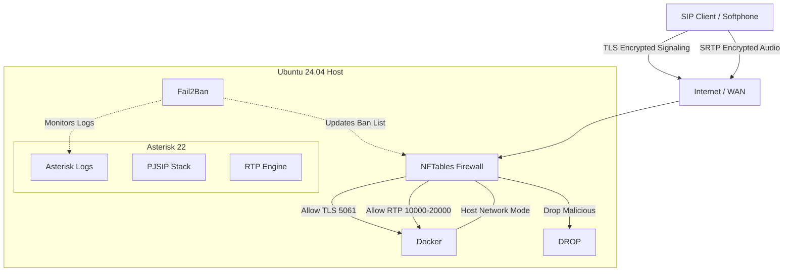

# 🛡️ VoIP Server Installer

[](https://github.com/weby-homelab/voip-installer/tags)
[](https://github.com/weby-homelab/voip-installer/actions/workflows/lint.yml)
[](https://github.com/weby-homelab/voip-installer/actions/workflows/test-install.yml)
[](LICENSE)

**Secure, Automated Asterisk Deployment for Ubuntu 24.04**

> A production-ready installer for a secure VoIP stack: **Asterisk 22** (Docker) + **PJSIP** + **TLS/SRTP** encryption + **Let's Encrypt** SSL + **Fail2Ban** & **NFTables**. Designed for privacy and ease of use.

---

# 📞 Asterisk Deployment Guide

**Version:** `v4.7.7`(Fix TLS transport: mount CA certs, correct permissions)

This guide describes the installation process for a secure VoIP server (**Asterisk 22** + **PJSIP** + **TLS/SRTP** + **Fail2Ban** + **NFTables**) on a clean **Ubuntu 24.04** server.

### 🌟 Features

* **Strict Firewall:** Uses `DROP` policy by default. Automatically detects SSH port to prevent lockout.
* **Auto-Install:** Automatically installs Docker, Docker Compose, Certbot, Fail2Ban, and NFTables.
* **Safe Mode:** Does **NOT** reset Docker network settings (no flush ruleset).
* **Log Rotation:** Enforces 100MB limit for Systemd Journal & Docker logs.
* **Security:** Uses TLS 1.3 on port `5061`.
* **Automation:** Automatic SSL generation (Let's Encrypt).

---

## 🛠 Step 1: Server Preparation

1. **Log in to the server** via SSH as root:
```bash
ssh root@your-server-ip

```


2. **Check Ports:** Ensure ports `80`, `443`, and `5061` are free.
> *Note: If this is a clean system installation, these ports should be free by default.*


---

## 📝 Step 2: Create the Script

1. Create an empty file for the script:
```bash
nano install.sh

```


2. **Copy** the FULL code of the script (`install.sh`) to your clipboard.
3. **Paste** the code into the terminal:
* **Windows** (PuTTY/PowerShell): Right-click.
* **Mac/Linux:** `Cmd+V` or `Ctrl+Shift+V`.


4. **Save and Close**:
* Press `Ctrl+O`, then `Enter`.
* Press `Ctrl+X`.


---

## 🚀 Step 3: Run Installation

1. Make the script executable:
```bash
chmod +x install.sh

```


2. **Run the script** (replace the placeholders with your actual data):
```bash
./install.sh --domain your-domain.com --email admin@your-domain.com

```


**Options:**
| Option | Description |
| :--- | :--- |
| `--domain` | Your domain name (required, must point to server IP). |
| `--email` | Email for Let's Encrypt certificate registration. |
| `--ext-ip` | *(Optional)* External IP if behind NAT. Usually auto-detected. |

---

## ⚙️ Step 4: Automated Actions

The script will automatically perform the following actions without your intervention:

1. 🐳 Install **Docker**, **Docker Compose**, **Certbot**, **Fail2Ban**, and **NFTables**.
2. 🔒 Obtain an **SSL certificate** via Certbot.
3. 👤 Generate passwords for users **100-105**.
4. 🛡️ Configure firewall (`table inet voip_firewall`) **without breaking Docker**.
5. ▶️ Start **Asterisk** in a container.

---

## ✅ Step 5: Post-Installation & Checks

### 1. Get SIP Credentials

Retrieve the generated passwords:

```bash
cat /root/voip-server/users.env

```

### 2. Check Container Status

Ensure the container is running healthy:

```bash
docker ps

```

> **Expected:** Status should be `"Up (healthy)"`.

### 3. Check Firewall Rules

Verify the rules were applied:

```bash
nft list table inet voip_firewall

```

### 🚨 3.1. Critical Check (Docker Network Safety)

Run these commands to verify that the firewall has not blocked container networking:

```bash
systemctl restart nftables
docker exec asterisk-voip curl -Is https://google.com | grep HTTP

```

* **Expected Result:** `HTTP/2 200` (or `HTTP/1.1 200`).
* **Why this works:**
* *Host network:* Container uses host IP/stack.
* *Used accept:* Outbound curl -> SYN -> matched as 'established' on return.
* *No block outbound:* Default policy is accept (Safe Mode).


> **Success:** If the test passes, Safe Mode is fully protecting Docker network connectivity.

### 4. Client Connection (e.g., Linphone)

Configure your softphone with these settings:

* **Username:** `100` (or 101-105)
* **Password:** *(from users.env)*
* **Domain:** `your-domain.com:5061`
* **Transport:** `TLS`
* **Media Encryption:** `SRTP`
* **AVPF:** Disabled (usually)
* **ICE:** Enabled

---

## 📂 Server Directory Structure

After installation, the server is organized as follows at `/root/voip-server/`:

```text
/root/voip-server/
├── config/
│   └── asterisk/
│       ├── pjsip.conf          # SIP settings (ports, transports)
│       ├── extensions.conf     # Dialplan logic
│       ├── modules.conf        # Loaded modules
│       ├── logger.conf         # Log settings
│       └── rtp.conf            # RTP ports
├── certs/                      # SSL Certificates (Let's Encrypt)
├── data/                       # Asterisk database & storage
├── logs/                       # Log files (security, CDRs)
├── qr_codes/                   # Client config QR codes
├── users.env                   # SIP Users & Passwords
└── docker-compose.yml          # Docker service definition
```

---

## 🏗 Architecture & Design Choices

The project leverages **`andrius/asterisk:22`** (based on Alpine Linux) instead of heavyweight FreePBX distributions. This is a deliberate choice prioritizing **security** and **performance**.



### Why not FreePBX?
Official distributions like FreePBX are designed for GUI management, requiring Apache, MySQL, PHP, and NodeJS, often exceeding **1 GB** in size. This creates a massive attack surface and complicates automation.

### Key Advantages:
* 🚀 **Lightweight:** Image size is only **~60 MB** (vs 1 GB+ for alternatives).
* ⚡ **Alpine Linux & Musl:** Minimal RAM footprint and instant container startup.
* 🛡️ **Hardened Security:** The container has **no Web UI**, database, or unnecessary services. Exploiting web vulnerabilities is impossible simply because there is no web server.
* 📄 **Infrastructure as Code (IaC):** Configuration is generated directly into `.conf` files via script. This is robust and transparent compared to modifying database entries.
* 🔧 **Pure PJSIP:** Utilizes a modern SIP stack, discarding the legacy `chan_sip`.

> **Verdict:** This is a solution for engineers who need a reliable, fast, and predictable "set and forget" VoIP server.

---

## 🔧 Troubleshooting

* **No Audio:** Check UDP range `10000-19999` in your hosting panel firewall (e.g., Hetzner Firewall / AWS Security Group).
* **SSL Error:** Ensure the domain A-record points correctly to the server.
* **View Logs:**
```bash
docker logs -f asterisk-voip

```

---

# 🐙 Deploying Asterisk from GitHub

**Repository:** `weby-homelab/voip-installer`
**Goal:** Quick start on a clean Ubuntu 24.04 server

Great move! Switching to a GitHub installation (`git clone`) is much more professional and reliable than manually copying text. It eliminates encoding errors and ensures you are using the latest version of the code.

### 📋 Requirements

* Clean server running **Ubuntu 24.04**.
* **Root** access.
* A **domain name** pointed to the server's IP address.

---

## 🚀 Option 1: Quick Installation (Recommended)

Use this method for a standard deployment. We will install git, download the repository, and run the script immediately.

### Step 1. Preparation & Cloning

Run these commands in the server console:

```bash
# 1. Update package lists and install git
apt update && apt install -y git

# 2. Clone the repository
git clone https://github.com/weby-homelab/voip-installer.git

# 3. Enter the directory
cd voip-installer

```

### Step 2. Run Installation


Make the script executable and run it with your parameters:


```bash

# 1. Make the script executable

chmod +x install.sh


# 2. Run it (REPLACE email and domain WITH YOUR OWN!)

./install.sh --email admin@your-domain.com --domain your-domain.com

```


---


## ⚡ Option 2: "One-Liner" (For Pros)


If you want to execute everything in a single line (useful for mass deployment or cloud-init scripts):


```bash

apt update && apt install -y git && \

git clone https://github.com/weby-homelab/voip-installer.git && \

cd voip-installer && \

chmod +x install.sh && \

./install.sh --email admin@your-domain.com --domain your-domain.com

```

---

## ✅ Post-Installation Checks

After the script finishes, configuration files may be located either inside the repository folder or in system paths (depending on the script logic).

1. **Check Status:**
```bash
docker ps

```


*(Status should be `Up (healthy)`)*
2. **Find SIP Passwords:**
Usually, the script generates a `users.env` file. Check for it:
```bash
# Option A (in current folder)
cat users.env

# Option B (in /root/voip-server, if the script creates it)
cat /root/voip-server/users.env

```


3. **Network Safety Test (Safe Mode):**
```bash
docker exec asterisk-voip curl -Is https://google.com | grep HTTP

```


*(Expected result: `HTTP/2 200`)*

---

## 💡 Tip: How to Update

If you update the code in the repository (e.g., fix bugs or add features), you only need to run this on the server:

```bash
cd ~/voip-installer
git pull
# Then rerun the script if a configuration update is required

```
