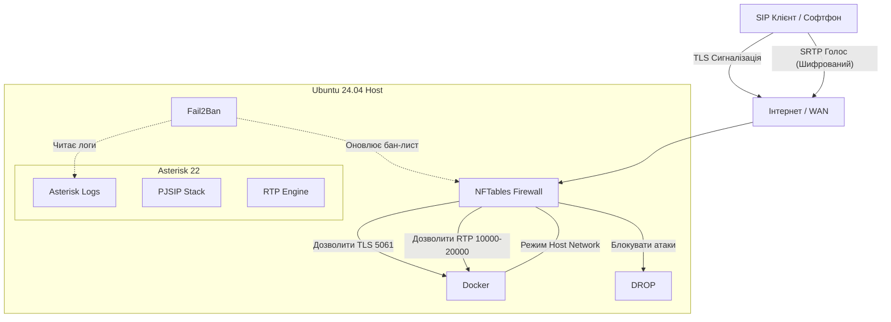

# 🛡️ VoIP Server Installer

[](https://github.com/weby-homelab/voip-installer/tags)
[](https://github.com/weby-homelab/voip-installer/actions/workflows/lint.yml)
[](https://github.com/weby-homelab/voip-installer/actions/workflows/test-install.yml)
[](LICENSE)

**Безпечне та автоматизоване розгортання Asterisk на Ubuntu 24.04**

> Готовий установник захищеного VoIP-сервера: **Asterisk 22** (Docker) + **PJSIP** + шифрування **TLS/SRTP** + **Let's Encrypt** SSL + **Fail2Ban** та **NFTables**. Створений для приватності та простоти використання.

---

# 📞 Інструкція з розгортання Asterisk

**Версія:** `v4.7.7` (Виправлено TLS транспорт: монтування CA сертифікатів, коректні права)

Ця інструкція описує процес встановлення безпечної версії сервера VoIP (**Asterisk 22** + **PJSIP** + **TLS/SRTP** + **Fail2Ban** + **NFTables**) на чистий сервер **Ubuntu 24.04**.

### 🌟 Особливості версії

* **Суворий Firewall:** Політика `DROP` за замовчуванням. Автоматичне визначення порту SSH для захисту від блокування.
* **Авто-встановлення:** Автоматично встановлює Docker, Docker Compose, Certbot, Fail2Ban та NFTables.
* **Safe Mode:** Не скидає налаштування мережі Docker (no flush ruleset).
* **Ротація логів:** Ліміт 100MB для Systemd Journal та Docker логів.
* **Безпека:** Використовує TLS 1.3 на порту `5061`.
* **Автоматизація:** Автоматична генерація SSL через Let's Encrypt.

---

## 🛠 Крок 1. Підготовка сервера

1. **Увійдіть на сервер** через SSH під root:
```bash
ssh root@your-server-ip

```


2. **Перевірте порти:** Переконайтеся, що порти `80`, `443` та `5061` вільні.
> *Примітка: Якщо це чисте встановлення системи, порти мають бути вільні за замовчуванням.*


---

## 📝 Крок 2. Створення скрипту

1. Створіть порожній файл для скрипту:
```bash
nano install.sh

```


2. **Скопіюйте** ПОВНИЙ код скрипту `v4.7.7` (`install.sh`) у буфер обміну.
3. **Вставте** код у термінал:
* **Windows** (PuTTY/PowerShell): Натисніть **ПРАВУ** кнопку миші.
* **Mac/Linux:** `Cmd+V` або `Ctrl+Shift+V`.


4. **Збережіть та закрийте файл**:
* Натисніть `Ctrl+O`, потім `Enter`.
* Натисніть `Ctrl+X`.


---

## 🚀 Крок 3. Запуск установки

1. Надайте права на виконання:
```bash
chmod +x install.sh

```


2. **Запустіть скрипт** (замініть дані на свої):
```bash
./install.sh --domain your-domain.com --email admin@your-domain.com

```


**Параметри запуску:**
| Параметр | Опис |
| :--- | :--- |
| `--domain` | Ваше доменне ім'я (обов'язково, має бути направлено на IP сервера). |
| `--email` | Пошта для реєстрації сертифіката Let's Encrypt. |
| `--ext-ip` | *(Опціонально)* Зовнішній IP, якщо сервер за NAT. Зазвичай визначається автоматично. |

---

## ⚙️ Крок 4. Що відбудеться автоматично

Скрипт виконає наступні дії без вашої участі:

1. 🐳 Встановить **Docker**, **Docker Compose**, **Certbot**, **Fail2Ban** та **NFTables**.
2. 🔒 Отримає **SSL сертифікат** через Certbot.
3. 👤 Згенерує паролі для користувачів **100-105**.
4. 🛡️ Налаштує firewall (таблиця `inet voip_firewall`), **не ламаючи Docker**.
5. ▶️ Запустить **Asterisk** у контейнері.

---

## ✅ Крок 5. Після встановлення та перевірки

### 1. Отримання паролів SIP

Перегляньте згенеровані паролі:

```bash
cat /root/voip-server/users.env

```


### 2. Статус контейнера

Переконайтеся, що контейнер запущений та працює нормально:

```bash
docker ps

```

> **Очікується:** Статус `"Up (healthy)"`.

### 3. Перевірка Firewall

Перевірте застосування правил:

```bash
nft list table inet voip_firewall

```

### 🚨 3.1. Критична перевірка (Docker Network Safety)

Виконайте ці команди, щоб переконатися, що firewall не заблокував мережу контейнерам:

```bash
systemctl restart nftables
docker exec asterisk-voip curl -Is https://google.com | grep HTTP

```

* **Очікуваний результат:** `HTTP/2 200` (або `HTTP/1.1 200`).
* **Чому це працює:**
* *Host network:* Контейнер використовує стек/IP хоста.
* *Used accept:* Вихідний curl -> SYN -> збіг 'established' при поверненні.
* *No block outbound:* Політика за замовчуванням accept (Safe Mode).


> **Успіх:** Якщо тест проходить — Safe Mode повністю захищає мережеву зв'язність Docker.

### 4. Підключення телефону (наприклад, Linphone)

Налаштуйте софтфон, використовуючи наступні дані:

* **Username:** `100` (або 101-105)
* **Password:** *(з файлу users.env)*
* **Domain:** `your-domain.com:5061`
* **Transport:** `TLS`
* **Media Encryption:** `SRTP`
* **AVPF:** Disabled (зазвичай)
* **ICE:** Enabled

---

## 📂 Структура файлів сервера

Після встановлення сервер буде організовано наступним чином у теці `/root/voip-server/`:

```text
/root/voip-server/
├── config/
│   └── asterisk/
│       ├── pjsip.conf          # Налаштування SIP (порти, транспорт)
│       ├── extensions.conf     # Логіка діалплану (дзвінків)
│       ├── modules.conf        # Завантаження модулів
│       ├── logger.conf         # Налаштування логів
│       └── rtp.conf            # Діапазон RTP портів
├── certs/                      # SSL Сертифікати (Let's Encrypt)
├── data/                       # Бази даних Asterisk та сховище
├── logs/                       # Логи (безпека, дзвінки/CDR)
├── qr_codes/                   # QR-коди для налаштування клієнтів
├── users.env                   # SIP користувачі та паролі
└── docker-compose.yml          # Конфігурація запуску Docker
```

---

## 🏗 Архітектура та вибір образу

У проєкті використовується **`andrius/asterisk:22`** (на базі Alpine Linux) замість великовагових збірок FreePBX. Це свідомий вибір на користь **безпеки** та **продуктивності**.



### Чому не FreePBX?
Офіційні дистрибутиви (FreePBX) призначені для керування через GUI, тягнуть за собою Apache, MySQL, PHP та NodeJS, займаючи **>1 ГБ**. Це створює величезну поверхню для атак та ускладнює автоматизацію.

### Переваги поточного рішення:
* 🚀 **Легковагість:** Образ важить лише **~60 МБ** (проти 1 ГБ+ у аналогів).
* ⚡ **Alpine Linux & Musl:** Мінімальне споживання RAM та миттєвий старт контейнера.
* 🛡️ **Безпека (Hardened):** У контейнері **немає веб-інтерфейсу**, бази даних та зайвих сервісів. Зламати через веб-вразливість неможливо, оскільки вебу просто немає.
* 📄 **Infrastructure as Code (IaC):** Конфігурація генерується скриптом безпосередньо в `.conf` файли. Це надійніше, ніж правити налаштування в базі даних FreePBX.
* 🔧 **Чистий PJSIP:** Використовується сучасний стек SIP без легасі-коду `chan_sip`.

> **Підсумок:** Це рішення для інженерів, яким потрібен надійний, швидкий та передбачуваний VoIP-сервер, що працює за принципом "поставив і забув".

---

## 🔧 Вирішення проблем (Troubleshooting)

* **Немає звуку:** Перевірте діапазон UDP `10000-19999` у панелі вашого хостингу (наприклад, Hetzner Firewall / AWS Security Group).
* **Помилка SSL:** Переконайтеся, що домен пінгується з самого сервера.
* **Логи Asterisk:**
```bash
docker logs -f asterisk-voip

```

---

# 🐙 Розгортання Asterisk з GitHub

**Репозиторий:** `weby-homelab/voip-installer`
**Мета:** Швидкий старт на чистому сервері Ubuntu 24.04

Встановлення через GitHub (`git clone`) — це набагато професійніше та надійніше, ніж копіювання тексту вручну. Це виключає помилки кодування та гарантує, що ви використовуєте останню версію коду.

Інструкція для розгортання прямо з репозиторію:

### 📋 Вимоги

* Чистий сервер **Ubuntu 24.04**.
* Права **root**.
* Домен, направлений на IP сервера.

---

## 🚀 Варіант 1: Швидке встановлення (рекомендовано)

Використовуйте цей метод для стандартного розгортання. Ми встановимо git, завантажимо репозиторій та відразу запустимо скрипт.

### Крок 1. Підготовка та клонування

Виконайте команди у консолі сервера:

```bash
# 1. Оновлюємо списки пакетів та ставимо git
apt update && apt install -y git

# 2. Клонуємо репозиторій
git clone https://github.com/weby-homelab/voip-installer.git

# 3. Переходимо в папку
cd voip-installer

```


### Крок 2. Запуск установки


Надаємо права на виконання та запускаємо скрипт з вашими параметрами:


```bash


# 1. Робимо скрипт виконуваним


chmod +x install.sh


# 2. Запускаємо (ЗАМІНІТЬ email та domain НА СВОЇ!)


./install.sh --email admin@your-domain.com --domain your-domain.com


```


---


## ⚡ Варіант 2: "One-Liner" (для профі)


Якщо ви хочете виконати все одним рядком (зручно для масового розгортання або скриптів cloud-init):


```bash


apt update && apt install -y git && \


git clone https://github.com/weby-homelab/voip-installer.git && \


cd voip-installer && \


chmod +x install.sh && \


./install.sh --email admin@your-domain.com --domain your-domain.com


```

---

## ✅ Що перевіряти після встановлення

Після того, як скрипт відпрацює, файли конфігурації можуть знаходитися або всередині папки репозиторію, або в системних шляхах (залежно від логіки скрипту).

1. **Перевірка статусу:**
```bash
docker ps

```


*(Має бути статус `Up (healthy)`)*
2. **Пошук паролів SIP:**
Зазвичай скрипт генерує файл `users.env`. Перевірте його наявність:
```bash
# Варіант А (у поточній папці)
cat users.env

# Варіант Б (у папці /root/voip-server, якщо скрипт створює її)
cat /root/voip-server/users.env

```


3. **Тест безпеки мережі (Safe Mode):**
```bash
docker exec asterisk-voip curl -Is https://google.com | grep HTTP

```


---

## 💡 Порада щодо оновлення

Якщо ви оновите код у репозиторії (наприклад, виправите баги або додасте фічі), на сервері достатньо виконати:

```bash
cd ~/voip-installer
git pull
# Потім перезапустити скрипт, якщо потрібне оновлення конфігурації

```
